# TABLE OF CONTENTS
***
* [Overview](#overview)
* [Installation](#installation)
* [User Guide](#user-guide)
* [Community Feedback](#community-feedback)
* [Developer Guide](#developer-guide)
* [Development History](#development-history)
* [Team](#team)
* [Deployment](#deployment)

# OVERVIEW
****
There are many food choices on campus: Campus Center, food trucks, Manoa Gardens, Paradise Palms, vending machines, and so forth. Let’s say you have a desire for chinese food today for lunch. What places on campus are serving chinese food menu items today? Alternatively, let’s say that you love the fresh salmon fillet at Campus Center, but that dish is only served once every few weeks. How do you find out on the day that it’s available?
Manoa-hunger-helper enables you to login on your phone and determine:

- What specific menu items will be available today at any Campus locations.
- What food is available right now.
- When a style of food you love is available today.

# TEAM 
***
 Four ICS students at the University of Hawaii at Manoa. 
 * [Yongxin yang](https://yongxinyang.github.io/)
 * [Feimei Chen](https://feimeichen.github.io/)
 * [Su Lao](https://sulao1999.github.io/)
 * [Jessica Ocampo](https://jnocampo.github.io/)

# Deployment
[Manoa Hunger Helper](http://104.236.106.167/#/)

# INSTALLATION 

First, [install Meteor](https://www.meteor.com/install).

Second, download a copy of [manoa-hunger-helper](https://github.com/manoa-hunger-helper/manoa-hunger-helper).

Third, cd into the app directory install the required libraries with:

```
$ meteor npm install
```

Once the libraries are installed, you can run the application by invoking:

```
$ meteor npm run start
```

The first time you run the app, it will create some default users and data. Here is the output:

```
meteor npm run start

> meteor-application-template-react@ start \Users\github\manoa-hungry-helper.github.io\app
> meteor --no-release-check --exclude-archs web.browser.legacy,web.cordova --settings ../config/settings.development.json

[[[[[ \Users\github\manoa-hungry-helper.github.io\app ]]]]]

=> Started proxy.
=> Started MongoDB.
W20210402-13:33:02.091(-10)? (STDERR) Note: you are using a pure-JavaScript implementation of bcrypt.
W20210402-13:33:02.218(-10)? (STDERR) While this implementation will work correctly, it is known to be
W20210402-13:33:02.219(-10)? (STDERR) approximately three times slower than the native implementation.
W20210402-13:33:02.219(-10)? (STDERR) In order to use the native implementation instead, run
W20210402-13:33:02.220(-10)? (STDERR)
W20210402-13:33:02.221(-10)? (STDERR)   meteor npm install --save bcrypt
W20210402-13:33:02.221(-10)? (STDERR)
W20210402-13:33:02.222(-10)? (STDERR) in the root directory of your application.
I20180227-13:33:02.716(-10)? Creating the default user(s)
I20180227-13:33:02.742(-10)?   Creating user admin@foo.com.
I20180227-13:33:02.743(-10)?   Creating user john@foo.com.
I20180227-13:33:02.743(-10)? Creating default data.
I20180227-13:33:02.743(-10)?   Adding: Basket (john@foo.com)
I20180227-13:33:02.743(-10)?   Adding: Bicycle (john@foo.com)
I20180227-13:33:02.743(-10)?   Adding: Banana (admin@foo.com)
I20180227-13:33:02.744(-10)?   Adding: Boogie Board (admin@foo.com)
I20180227-13:33:02.745(-10)? Monti APM: completed instrumenting the app
=> Started your app.

=> App running at: http://localhost:3000/
   Type Control-C twice to stop.
```

### Note regarding "bcrypt warning":

```
W20210402-13:33:02.091(-10)? (STDERR) Note: you are using a pure-JavaScript implementation of bcrypt.
W20210402-13:33:02.218(-10)? (STDERR) While this implementation will work correctly, it is known to be
W20210402-13:33:02.219(-10)? (STDERR) approximately three times slower than the native implementation.
W20210402-13:33:02.219(-10)? (STDERR) In order to use the native implementation instead, run
W20210402-13:33:02.220(-10)? (STDERR)
W20210402-13:33:02.221(-10)? (STDERR)   meteor npm install --save bcrypt
W20210402-13:33:02.221(-10)? (STDERR)
W20210402-13:33:02.222(-10)? (STDERR) in the root directory of your application.
```

On some operating systems (particularly Windows), installing bcrypt is much more difficult than implied by the above message. Bcrypt is only used in Meteor for password checking, so the performance implications are negligible until your site has very high traffic. You can safely ignore this warning without any problems during initial stages of development.

If all goes well, the template application will appear at [http://localhost:3000](http://localhost:3000). You can login using the credentials in [settings.development.json](https://github.com/manoa-hunger-helper/manoa-hunger-helper/blob/master/config/settings.development.json), or else register a new account.

# USER GUIDE

## [Landing Page](https://github.com/manoa-hunger-helper/manoa-hunger-helper.github.io/blob/main/images/landing.JPG)

The landing page is presented to visitors and brings up a brief introduction to the users and vendors about the functionality of this application. 

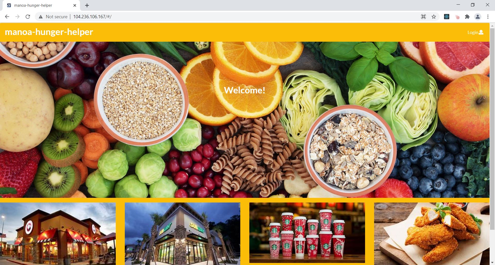

## [Sign Up](https://github.com/manoa-hunger-helper/manoa-hunger-helper.github.io/blob/main/images/signup.JPG)

If you do not yet have an account on the system, you can register by clicking on “Login”, then the sign up page will show up:

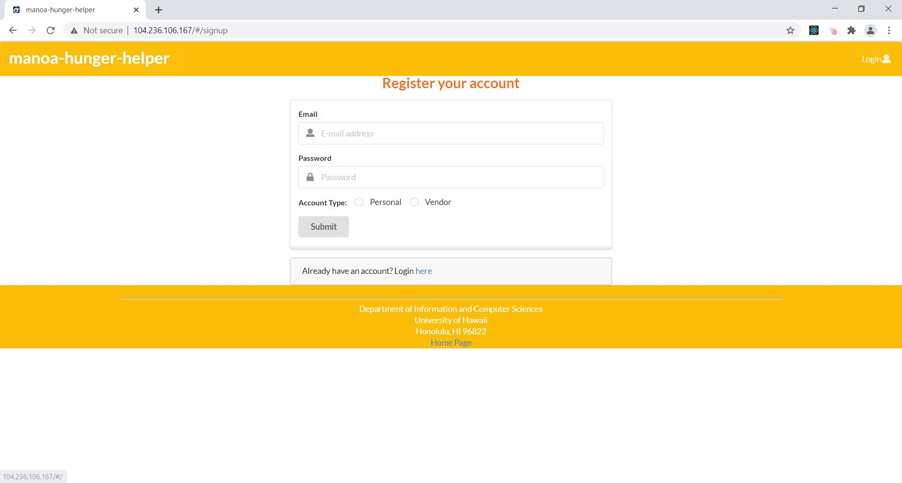

## [Sign In](https://github.com/manoa-hunger-helper/manoa-hunger-helper.github.io/blob/main/images/signin.JPG)

A return user can login in through this page.


## [User Homepage](https://github.com/manoa-hunger-helper/manoa-hunger-helper.github.io/blob/main/images/user-home.JPG)

The user homepage will show up when the user logs in successfully. It is just similar to the landing page, but the message in the middle is describing what the users can expect through the All vendors page and Today’s Top Pick page.  The links to these two pages and the other two are accessible at the top Menu Bar. 

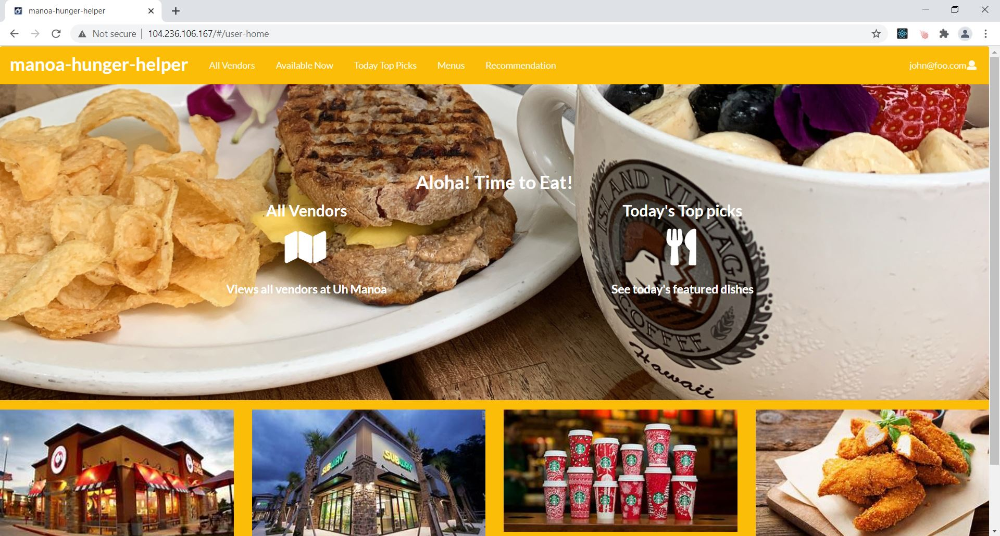

 * [My Profile page](https://github.com/manoa-hunger-helper/manoa-hunger-helper.github.io/blob/main/images/Hunger-Helper-MyProfile.jpg)
  
   In this page, users can Users can add new or remove current preferences on the food type (ie. vegetarian, hawaiian, drink etc.). They can “like” vendors in the    All Vendors page and these vendors will be viewable under “My favorite vendors”. 
  
 
  
 * [All Vendors page](https://github.com/manoa-hunger-helper/manoa-hunger-helper.github.io/blob/main/images/Hunger-Helper-AllVendors.jpg)
 
   Simply list all the vendors available at UH Manoa (in the card format). Allowing users to like or unlike. 
 
 
 
 * [Vendors Now Available page](https://github.com/manoa-hunger-helper/manoa-hunger-helper.github.io/blob/main/images/Hunger-Helper-Vendors-available.jpg)

   List all the vendors that are open at UH Manoa at this specific time. (in the card format). 
 
  
  
 * [Today’s top picks page](https://github.com/manoa-hunger-helper/manoa-hunger-helper.github.io/blob/main/images/Hunger-Helper-today-top-pick.jpg)
   
   This page displays the featured menu item curated by vendors.
  
  
  
 * [Recommendation page](https://github.com/manoa-hunger-helper/manoa-hunger-helper.github.io/blob/main/images/Hunger-Helper-recommendation.jpg)
   
   This page will show all of the menu items that match the preferences associated with the logged in user.

  
 
## [Vendor Homepage]()
   
   The Vendor homepage will show up when the logged in user has the Vendor role. It is also similar to the landing page, but the message in the middle clarifies   
   what the vendor can do through the All vendors page and My Vendor page. The links to these two pages are accessible at the top Menu Bar (may have more if time 
   permits, like Add Vendor, Add feature item...).
   
   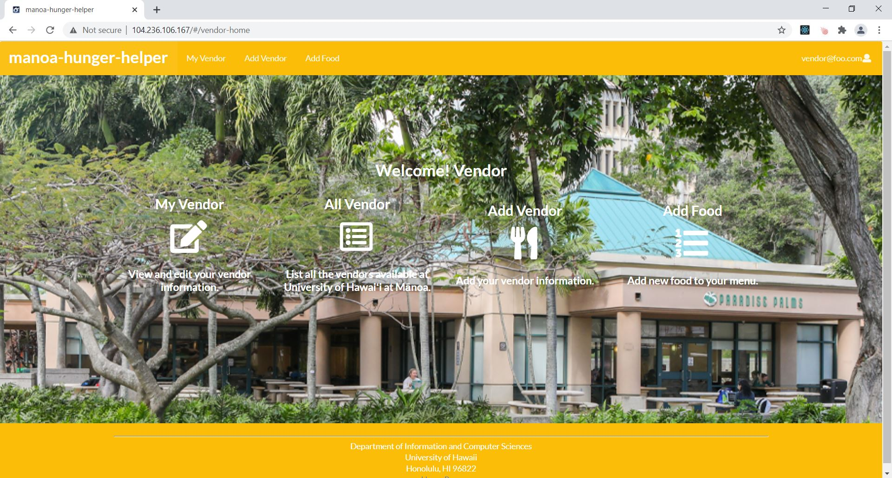

 * [My Vendor page](https://github.com/manoa-hunger-helper/manoa-hunger-helper.github.io/blob/main/images/my-vendor.JPG)
 
   Allows the logged in vendor to edit their information as well as their menu items, including adding or deleting a menu item; modifying the price or type of the    item; changing the ethnicity, location, open hour, contact, payment option image of the restaurant.  

  
 
 * [All Vendors page](https://github.com/manoa-hunger-helper/manoa-hunger-helper.github.io/blob/main/images/All-vendor.jpeg)
 
  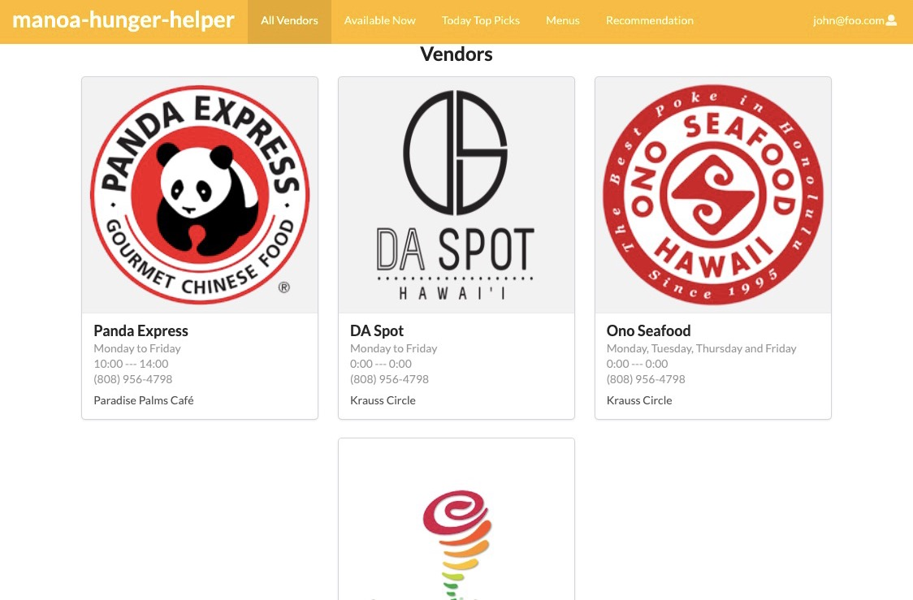
  
  * [Edit my vendor page](https://github.com/manoa-hunger-helper/manoa-hunger-helper.github.io/blob/main/images/edit-vendor.jpeg)
  
  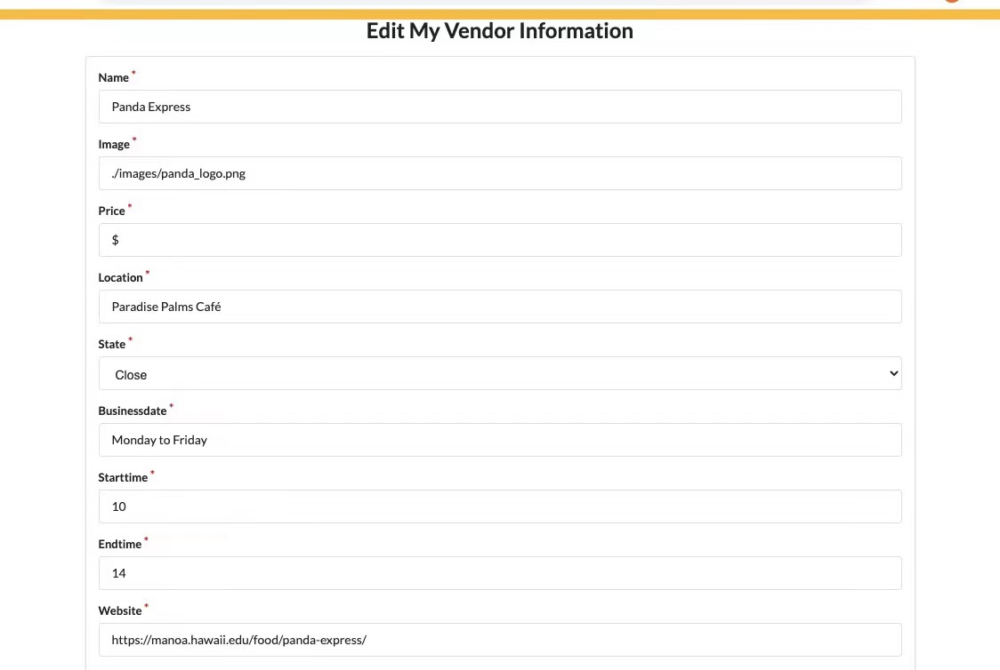
  
  * [Edit my menu page](https://github.com/manoa-hunger-helper/manoa-hunger-helper.github.io/blob/main/images/edit-menu.jpeg)
  
  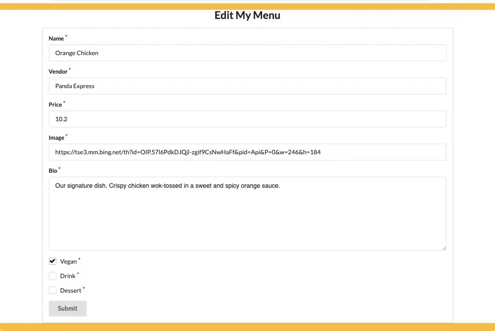
  
  * [Add Vendor Information page](https://github.com/manoa-hunger-helper/manoa-hunger-helper.github.io/blob/main/images/vendor-add-info.JPG)
  
  Allows the logged in vendor to add information.
 
  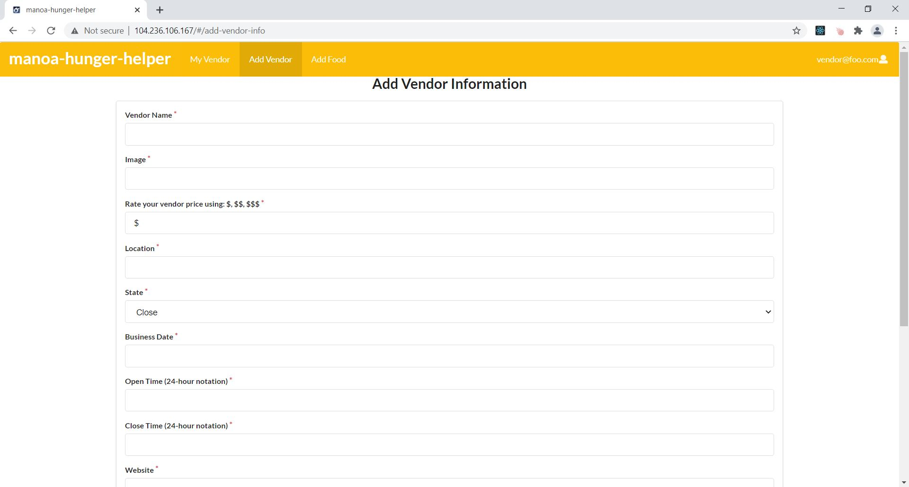
  
  * [Add Vendor Information page](https://github.com/manoa-hunger-helper/manoa-hunger-helper.github.io/blob/main/images/vendor-add-menu-food.JPG)

  Allows the logged in vendor to add food to menu.
 
  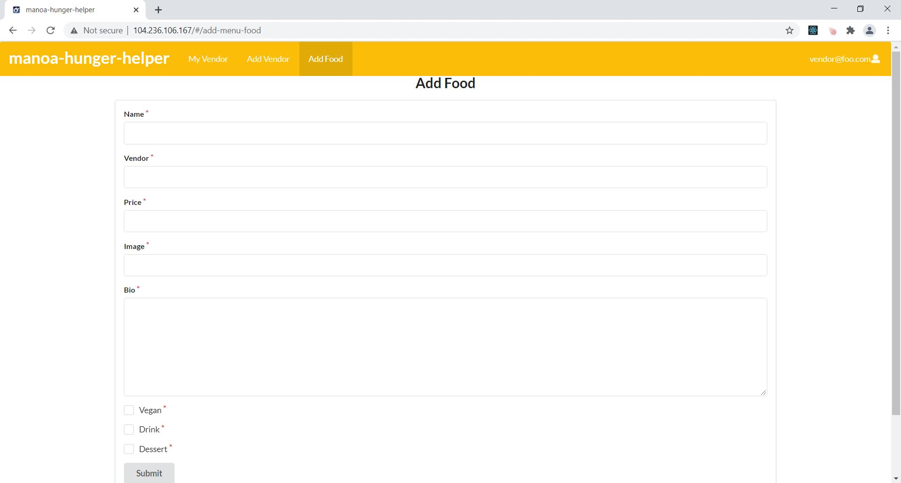

## [Admin Homepage](https://github.com/manoa-hunger-helper/manoa-hunger-helper.github.io/blob/main/images/images/admin-home.JPG)
   
   The Admin homepage will show up when the logged in user has the Admin role. It is again similar to the landing page, with the message in the middle clarifying  
   the authority an admin has. The links to the Manage Users page and Manage Vendor page are accessible at the top Menu Bar. 
   
   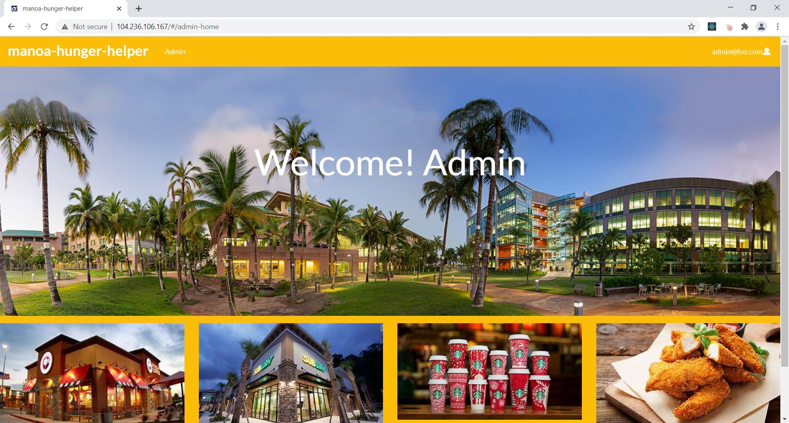

 * [Manage users page]()
 
   Verified admin users get the access to edit users’ preferences. 

  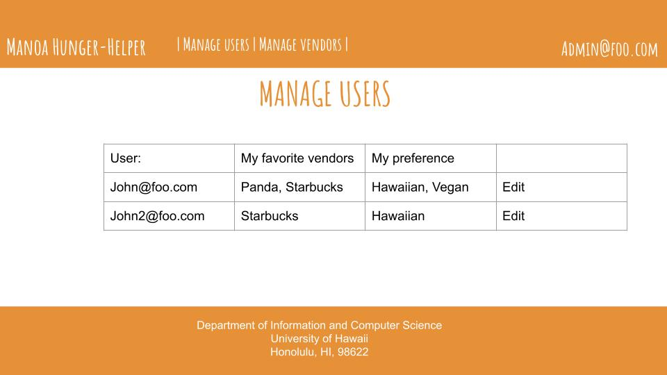
   
 * [Manage Vendors page]()

   Verified admin users get the access to remove  the vendor that is no longer available. 
   
  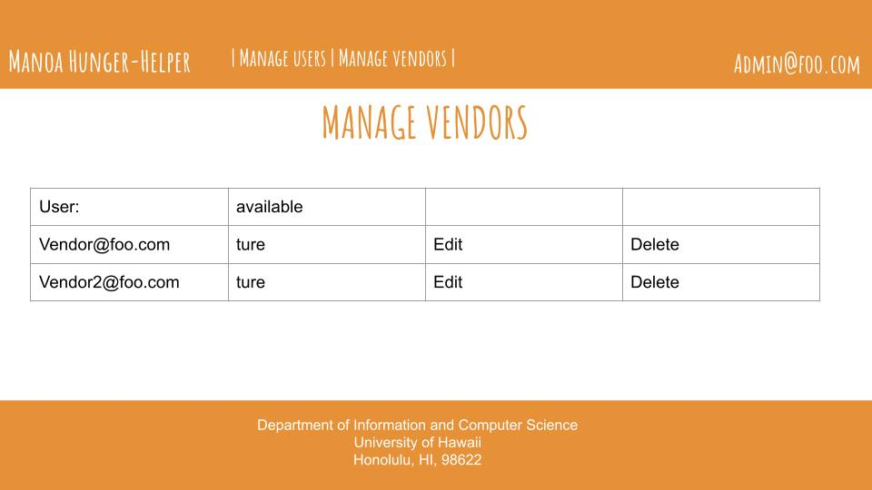
  

# DEVELOPMENT HISTORY

 * [M1](https://github.com/manoa-hunger-helper/manoa-hunger-helper/projects/1)
 * [M2](https://github.com/manoa-hunger-helper/manoa-hunger-helper/projects/3)
 * [M3]()
