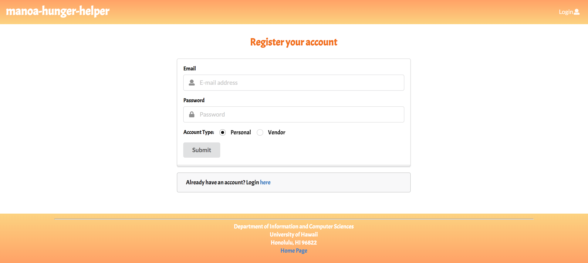
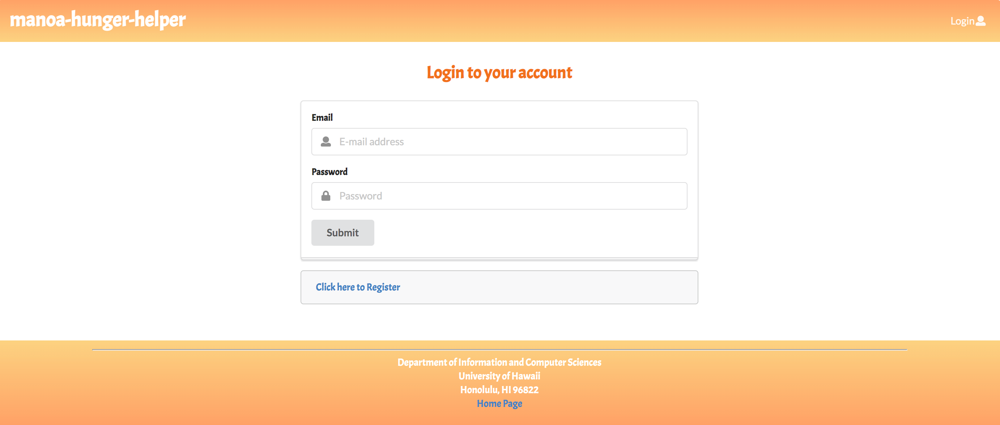
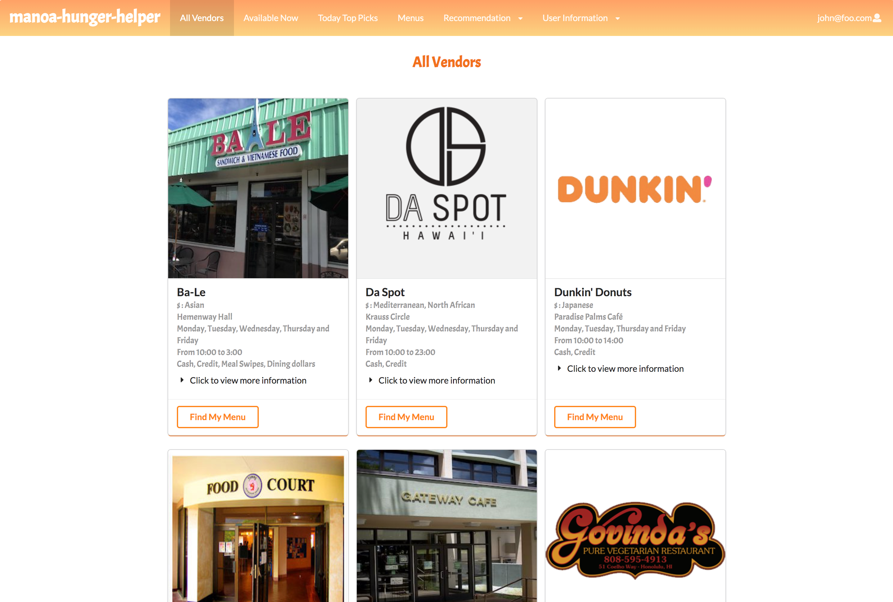
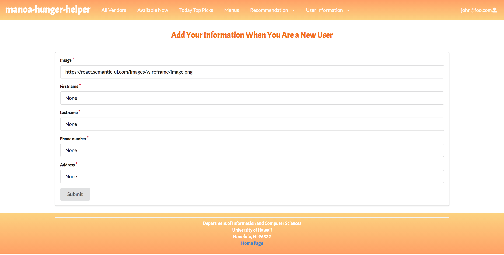
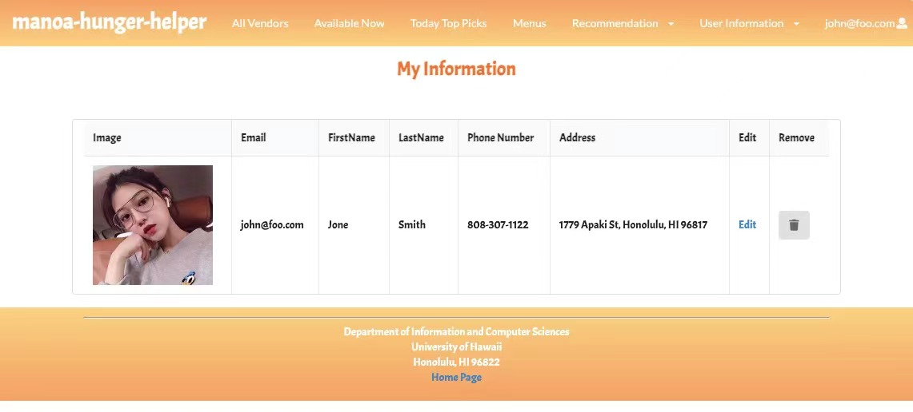
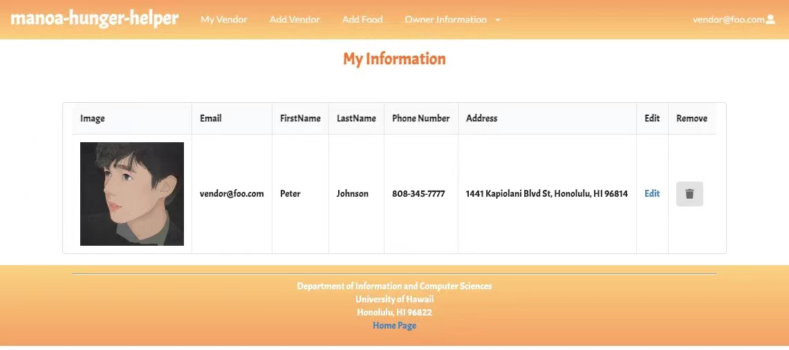

# TABLE OF CONTENTS
***
* [Overview](#overview)
* [User Guide](#user-guide)
* [Community Feedback](#community-feedback)
* [Developer Guide](#developer-guide)
* [Development History](#development-history)
* [Team](#team)
* [Deployment](#deployment)

# OVERVIEW
****
There are many food choices on campus: Campus Center, food trucks, Manoa Gardens, Paradise Palms, vending machines, and so forth. Let’s say you have a desire for chinese food today for lunch. What places on campus are serving chinese food menu items today? Alternatively, let’s say that you love the fresh salmon fillet at Campus Center, but that dish is only served once every few weeks. How do you find out on the day that it’s available?
Manoa-hunger-helper enables you to login on your phone and determine:

- What specific menu items will be available today at any Campus locations.
- What food is available right now.
- When a style of food you love is available today.

# TEAM
***
 Four ICS students at the University of Hawaii at Manoa.
 * [Yongxin yang](https://yongxinyang.github.io/)
 * [Feimei Chen](https://feimeichen.github.io/)
 * [Su Lao](https://sulao1999.github.io/)
 * [Jessica Ocampo](https://jnocampo.github.io/)

# USER GUIDE

## [Landing Page](http://104.236.106.167/#/)

The landing page is presented to visitors and brings up a brief introduction to the users and vendors about the functionality of this application.


## [Sign Up](http://104.236.106.167/#/signup)

If you do not yet have an account on the system, you can register by clicking on “Login”, then the sign up page will show up:



## [Sign In](http://104.236.106.167/#/signin)

A return user can login in through this page.



## [User Homepage](http://104.236.106.167/#/user-home)

The user homepage will show up when the user logs in successfully. It is just similar to the landing page, but the message in the middle is describing what the users can expect through the All vendors page and Today’s Top Pick page.  The links to these two pages and the other two are accessible at the top Menu Bar.


 * [All Vendors page](http://104.236.106.167/#/all-vendors)

 Simply list all the vendors available at UH Manoa with detailed information.

  

  


 * [Vendors Now Available page](http://104.236.106.167/#/available-vendors)

   List all the vendors that are open at UH Manoa at this specific time. (in the card format).

  

 * [Today’s top picks page](http://104.236.106.167/#/todays-top-picks)

   This page displays the featured menu item recommended by users. Also indicates the number of times each item is recommended.

  

  * [Menu page](http://104.236.106.167/#/view)

   This page allows users to search the specific menu item based on the ethnicity of food.

  

 * [Recommendation page](http://104.236.106.167/#/vegan-menu)

   There are three submenus to fit users'references. Users could go to each category of the menu by clicking on the corresponding options.

  

  * [Add my information page](http://104.236.106.167/#/add-my-information)

   In this page, the new registered user can add his personal information by filling out the form, the returned user can only edit his information.

  

  

  * [View my information page](http://104.236.106.167/#/my-information)

   In this page, the logged in user can view and edit his personal information.

  

## [Vendor Homepage](http://104.236.106.167/#/vendor-home)

   The Vendor homepage will show up when the logged in user has the Vendor role. It is also similar to the landing page, but the message in the middle clarifies
   what the vendor can do through the All vendors page and My Vendor page. The links to these two pages are accessible at the top Menu Bar (may have more if time
   permits, like Add Vendor, Add feature item...).

   

 * [My Vendor page](http://104.236.106.167/#/my-vendor)

   Allows the logged in vendor to edit their information as well as their menu items, including adding or deleting a menu item; modifying the price or type of the    item; changing the ethnicity, location, open hour, contact, payment option image of the restaurant.

  

  * [Edit my vendor page](http://104.236.106.167/#/editVedorInfor/v5grbRaGEMcBN28H3)

  

  * [Edit my menu page](http://104.236.106.167/#/editMyMenu/mkQhSA6JNwtJ3bc4w)

  

  * [Add Vendor Information page](http://104.236.106.167/#/add-vendor-info)

  Allows the logged in vendor to add information.

  

  * [Add Food page](http://104.236.106.167/#/add-menu-food)

  Allows the logged in vendor to add food to menu.

  

  * [View My Information](http://104.236.106.167/#/my-information)

   Vendor can also view his added information in this page.

  

  * [Add My Information](http://104.236.106.167/#/add-my-information)

  

  

   New Vendors should add contact information so that admins and others can find the contact information.

## [Admin Homepage](http://104.236.106.167/#/admin-home)

   The Admin homepage will show up when the logged in user has the Admin role. It is again similar to the landing page, with the message in the middle clarifying
   the authority an admin has. The links to the Manage Users page and Manage Vendor page are accessible at the top Menu Bar.

   

 * [Manage users page](http://104.236.106.167/#/admin-manage-users)

   Verified admin users get the access to edit users’ information or remove the user that is no longer active.

  

 * [Manage Vendors page](http://104.236.106.167/#/admin-manage-vendors)

   Verified admin users get the access to remove the vendor that is no longer available.

  

# DEVELOPER GUIDE

First, [install Meteor](https://www.meteor.com/install).

Second, download a copy of [manoa-hunger-helper](https://github.com/manoa-hunger-helper/manoa-hunger-helper).

Third, cd into the app directory install the required libraries with:

```
$ meteor npm install
```

Once the libraries are installed, you can run the application by invoking:

```
$ meteor npm run start
```

The first time you run the app, it will create some default users and data. Here is the output:

```
meteor npm run start

> meteor-application-template-react@ start \Users\github\manoa-hungry-helper.github.io\app
> meteor --no-release-check --exclude-archs web.browser.legacy,web.cordova --settings ../config/settings.development.json

[[[[[ \Users\github\manoa-hungry-helper.github.io\app ]]]]]

=> Started proxy.
=> Started MongoDB.
W20210402-13:33:02.091(-10)? (STDERR) Note: you are using a pure-JavaScript implementation of bcrypt.
W20210402-13:33:02.218(-10)? (STDERR) While this implementation will work correctly, it is known to be
W20210402-13:33:02.219(-10)? (STDERR) approximately three times slower than the native implementation.
W20210402-13:33:02.219(-10)? (STDERR) In order to use the native implementation instead, run
W20210402-13:33:02.220(-10)? (STDERR)
W20210402-13:33:02.221(-10)? (STDERR)   meteor npm install --save bcrypt
W20210402-13:33:02.221(-10)? (STDERR)
W20210402-13:33:02.222(-10)? (STDERR) in the root directory of your application.
I20180227-13:33:02.716(-10)? Creating the default user(s)
I20180227-13:33:02.742(-10)?   Creating user admin@foo.com.
I20180227-13:33:02.743(-10)?   Creating user john@foo.com.
I20180227-13:33:02.743(-10)? Creating default data.
I20180227-13:33:02.743(-10)?   Adding: Basket (john@foo.com)
I20180227-13:33:02.743(-10)?   Adding: Bicycle (john@foo.com)
I20180227-13:33:02.743(-10)?   Adding: Banana (admin@foo.com)
I20180227-13:33:02.744(-10)?   Adding: Boogie Board (admin@foo.com)
I20180227-13:33:02.745(-10)? Monti APM: completed instrumenting the app
=> Started your app.

=> App running at: http://localhost:3000/
   Type Control-C twice to stop.
```

### Note regarding "bcrypt warning":

```
W20210402-13:33:02.091(-10)? (STDERR) Note: you are using a pure-JavaScript implementation of bcrypt.
W20210402-13:33:02.218(-10)? (STDERR) While this implementation will work correctly, it is known to be
W20210402-13:33:02.219(-10)? (STDERR) approximately three times slower than the native implementation.
W20210402-13:33:02.219(-10)? (STDERR) In order to use the native implementation instead, run
W20210402-13:33:02.220(-10)? (STDERR)
W20210402-13:33:02.221(-10)? (STDERR)   meteor npm install --save bcrypt
W20210402-13:33:02.221(-10)? (STDERR)
W20210402-13:33:02.222(-10)? (STDERR) in the root directory of your application.
```

On some operating systems (particularly Windows), installing bcrypt is much more difficult than implied by the above message. Bcrypt is only used in Meteor for password checking, so the performance implications are negligible until your site has very high traffic. You can safely ignore this warning without any problems during initial stages of development.

If all goes well, the template application will appear at [http://localhost:3000](http://localhost:3000). You can login using the credentials in [settings.development.json](https://github.com/manoa-hunger-helper/manoa-hunger-helper/blob/6d37cf6c329e4f182db121ac988e0dd787b417ad/config/settings.development.json#L110), or else register a new account.

## Initialization
Run meteor reset to reset the system with default data
```
meteor reset
```

## ESLint
Eslint is the coding standard used in this project. Run meteor npm run lint to check eslint error.
```
meteor npm run lint
```

## TestCafe
TestCafe is available tests for all pages. Use testcafe can easy to test all pages in the application are displayed, and that all forms operate correctly with legal inputs.
```
meteor npm run testcafe
```

# Deployment
[Manoa Hunger Helper](http://104.236.106.167/#/)

# DEVELOPMENT HISTORY

 * [M1](https://github.com/manoa-hunger-helper/manoa-hunger-helper/projects/1)

 

 * [M2](https://github.com/manoa-hunger-helper/manoa-hunger-helper/projects/3)


 * [M3](https://github.com/manoa-hunger-helper/manoa-hunger-helper/projects/4)

# COMMUNITY FEEDBACK

 * Awesome website, perfect for people don’t have Yelp. Pictures are making hungry already, it would be the best if you can actually make the two buttons for all venders and today’s pick in front page “aloha time to eat” clickable.
 * Good website. I think the website should allow people to access all vendor page and menu pages without logging in to their account. This allows the visitor to understand the website.
 * Very Interesting and useful. I like the efficiency of this application as I only need one-click to sign up and recommend food. I first thought the two logos in the middle can link to somewhere. I probably would feel a bit strange why a user need to enter address and phone number. Despite of that, Other things look pretty good! Your layout is clean, simple and well-organized and the text font is big enough to catch my eyes. I also enjoy the Hawaiian style of your app.
 * The website looks good to me. There are introductions and pictures. I can kinda understand the website by clicking/playing around on the navbar.
 * Amazing page!!! You can find all different types of food in this page and learn more about the restaurant you are interested. Maybe you guys can add a review section in the future for users as references :)
